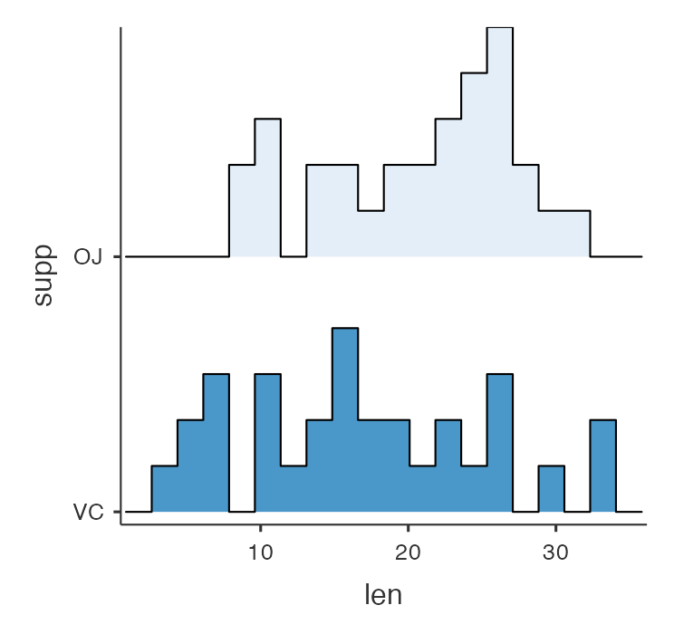
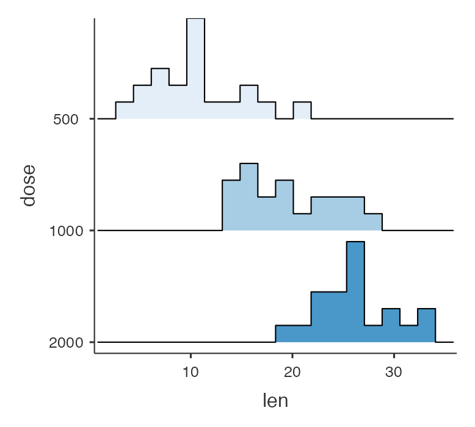

jamovi 2.7.16 introduced user-resizable images. This allows a user to select an image, and then resize it by click and dragging the resize control to the bottom right of the image.

For most plots, the default behaviour will work fine. However, in the case of plots where the width of the Y-axis, or the height of the X-axis changes depending on the data, or where a plot makes use of faceting, some additional tweaks to the plot may improve its resize behaviour.

Let's consider the following plot that a user might have resized.



Now let's say that the user changes the plot to as follows:



As we can see the number of "rows" in the plot has increased from two to three. But notice how the height of the "rows" has decreased? Now perhaps this is actually desireable, but then again, maybe it isn't. The user might have chosen the size of the image so as to achieve a certain height of the "row". We might decide that when a plot changes from 2 "rows" to 3, that we try and preserve the height of the "rows". However, going from 2 to 3 rows is not simply a matter of increasing the height by 50%, because of course, the x-axis takes up a constant amount of height irrespective of how the image is scaled. The solution is to provide additional `widthB` and `heightB` parameters for each image, which guides the resizing process.

For example, returning to the first plot:


We can see that the height of the plot is made up of two areas. The "stretchable" area, designated with the red, and the "fixed" area designated with the blue. In this example, the height of the image might be 600px, with 500px stretchable, and 100px fixed (and, let us say 500px stretchable and 100px fixed making up the width too). To provide this information to the image, we call:

```
self$results$imageName$setSize2(500, 500, 100, 100)

# or for backward compatibility (recommended!)

if (is.null(self$results$imageName[["setSize2"]])) {
    self$results$imageName$setSize(600, 600)
} else {
    self$results$imageName$setSize2(500, 500, 100, 100)
}

```

let's say the user resizes the image to be 20% larger, it's now 720px by 720px. jamovi computes a scale factor;

```
scaleHeight = (imageHeight - heightB) / heightM
scaleWidth = (imageWidth - widthB) / widthM

# or

scaleHeight = (720 - 100) / 500  # = 1.24
scaleWidth = (720 - 100) / 500   # = 1.24
```

with this example, we can see that the stretchable height is now 620px (720-100), or 310px per row.

now the user changes the plot so that it contains 3 "rows", rather than 2 rows. if the analysis wishes to preserve the height of the rows, the analysis might specify:

```
self$results$imageName$setSize2(500, 250 * nrows, 100, 100)

# effectively

self$results$imageName$setSize2(500, 750, 100, 100)
```

now let's observe how this, when combined with the 1.24 scale factor, effects the final image size. the size is computed as follows:

```
imageWidth = widthM * scaleWidth + widthB
imageHeight = heightM * scaleHeight + heightB

imageWidth = 500 * 1.24 + 100   # 720px
imageHeight = 750 * 1.24 + 100  # 1030px
```

the key result here is that the height of each row is held constant at 310px (750 * 1.24 / 3).


