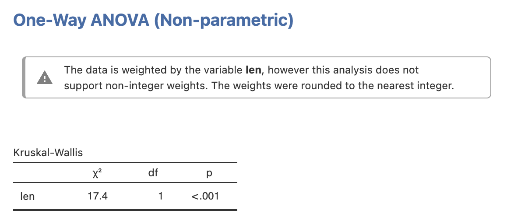
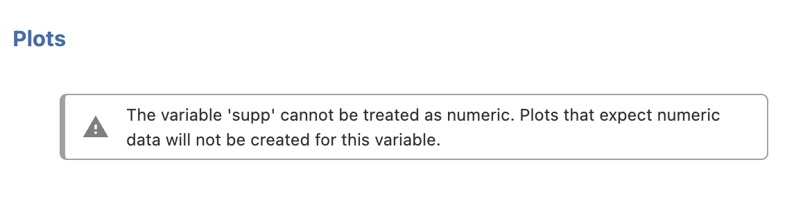

Analyses can provide the user with notices that are displayed within the results.

See the following examples:






Notices can be constructed as per:

```
notice <- jmvcore::Notice$new(
    options=self$options,  # self$options from the parent analysis
    name='whateverYouLike',  # results objects in jamovi must have a unique name
    type=jmvcore::NoticeType$STRONG_WARNING  # more options are possible, see below
)

notice$setContent('The fish was delish')  # set the content
self$results$insert(1, notice)  # insert the notice at the top of the results
```

Valid values for the type of notice are:

```
NoticeType$ERROR
NoticeType$STRONG_WARNING
NoticeType$WARNING
NoticeType$INFO
```

We suggest you avoid using HTML in the content of your notices.

