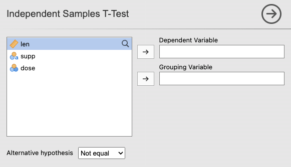
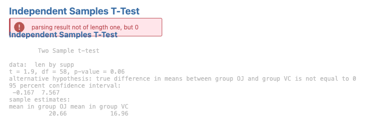

Hopefully you got through the last section without encountering any errors in your analysis. In this section, we'll explore how to debug an analysis. First, we’ll walk through a common scenario where required user input is missing. Then, we’ll switch to the developer view to troubleshoot analysis-specific errors.

First, we will show a common scenario in which an error message is presented due to a users lack of inputs. Start by removing both `len` from the `Dependent Variable` and also remove `supp` from the `Grouping Variable`. The variables should be removed from these sections and look like this:

{width="400"}

Now, you will see an error message where the output previously appeared: {width="600"}

This error message tells us that the data passed through has a length of 0 because the user hasn’t selected any variables yet. It’s best practice to avoid showing user-error messages in these initial steps when the issue isn’t true user error, but simply missing required inputs. To prevent this, we’re going to add a short guard clause to our `ttest.b.R` file:

```         
          if (length(self$options$dep) == 0 || length(self$options$group) == 0) {
            return()
          }
```

The full script for 'ttest.b.R' file should currently look like this:

```         
ttestClass <- if (requireNamespace('jmvcore', quietly=TRUE)) R6::R6Class(
    "ttestClass",
    inherit = ttestBase,
    private = list(
        .run = function() {
          
          if (length(self$options$dep) == 0 || length(self$options$group) == 0) {
            return()
          }
          
          formula <- jmvcore::constructFormula(self$options$dep, self$options$group) 
          formula <- as.formula(formula)
          
          results <- t.test(formula, self$data, var.equal=self$options$varEq)
          
          self$results$text$setContent(results)

        })
)
```

So now, if the user hasn’t selected both a `Dependent Variable` and a `Grouping Variable`, the analysis will exit early without attempting to run the t-test. This prevents jamovi from displaying an error message while the analysis is still in its initial (incomplete) setup state.

For this next step we are going to show how to debug an analysis that has gone wrong using the dev mode. Lets change our `.run()` function in the `ttest.b.R` to produce an error:

```         
ttestISClass <- R6Class("ttestISClass",
    inherit=ttestISBase,
    private=list(
        .run=function() {

            t.test(c(Inf, 3))  # <-- produces an error!
        })
)
```

We receive the following error message.

{width="290px"}

In this example, our code is only one line of code, so we can be reasonably confident where the problem lies. However, in practice software can be two or three or even more lines of code. In more complex situations, it can be handy to have a 'stack trace' which tells us where the problem occurred. jamovi can be placed in 'dev mode', which displays stack traces when errors occur. dev mode can be toggled from the app menu to the top right of the jamovi window:

{width="294px"}

With dev mode turned on, we can see the stack trace and see that the call to `t.test(c(Inf, 3))` is responsible for the error.

{width="356px"}

When developing jamovi modules, it's best to just leave dev mode on.

Next: [Creating Rich Results](tuts0105-creating-rich-results.html)
